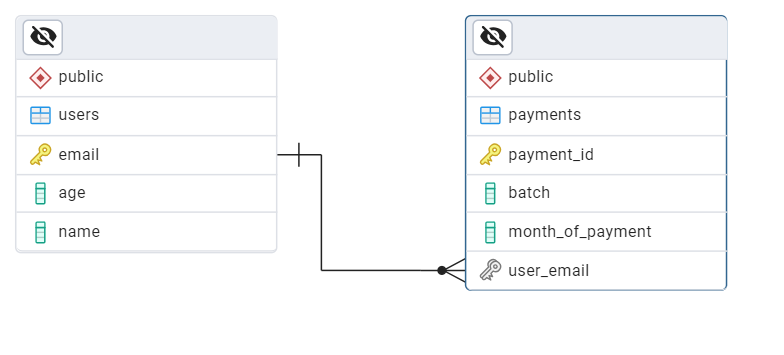
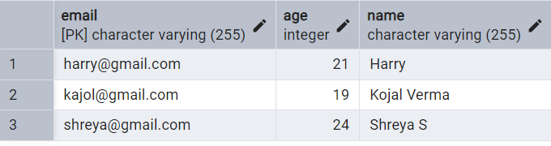
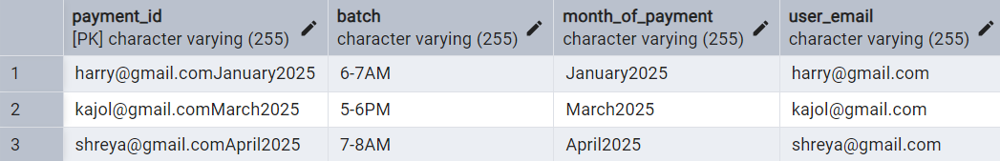
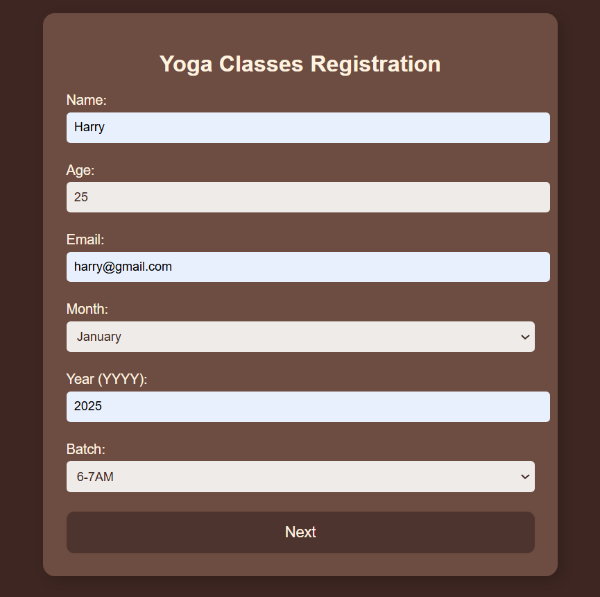
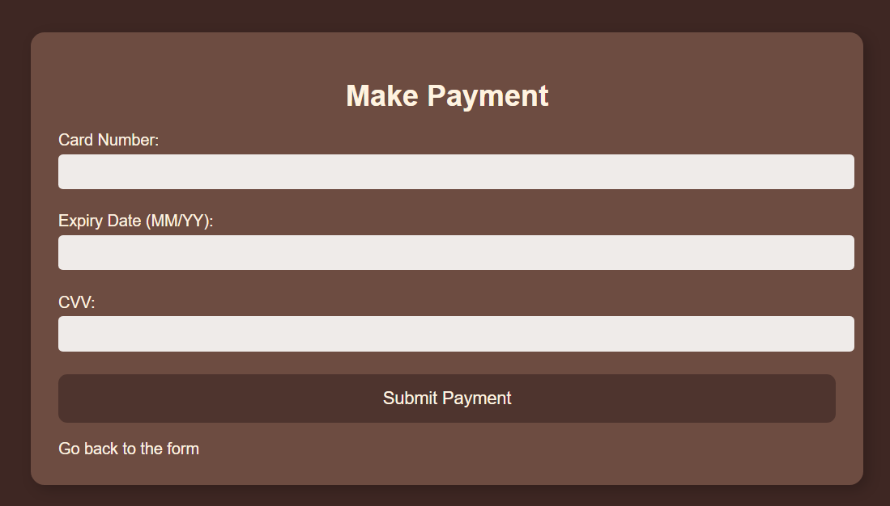
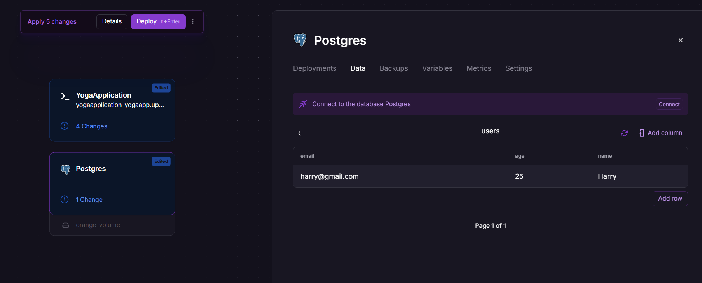

# Yoga Class Admission Form

This project is an implementation of an admission form for Yoga Classes that happens every month. It is designed to handle user enrollment, payment processing, and store data in a PostgreSQL database. The solution is built using **Spring Boot**, **Spring MVC**, **Spring Data JPA**, and **PostgreSQL** for the backend, with a basic frontend interface using **Thymeleaf**. The project is hosted on Railway.

## Table of Contents

1. [Problem Statement](#problem-statement)
2. [Features](#features)
3. [Database Schema](#database-schema)
4. [Implementation](#implementation)
    - [Frontend](#frontend)
    - [Backend](#backend)
    - [Payment Handling](#payment-handling)
5. [Setup](#setup)
    - [Prerequisites](#prerequisites)
    - [Running the Backend](#running-the-backend)
    - [Running the Frontend](#running-the-frontend)
6. [Usage](#usage)

## Problem Statement

The goal of this project was to build a Yoga class admission form, where users can register for a monthly subscription. The form should validate user age (18-65 years), ensure payment is made for the month, and allow participants to choose a batch each month.

## Features

- **Age Validation**: Only users between 18 and 65 years old can register.
- **Payment Validation**: Users can pay anytime during the month, but they must pay for the entire month. The fee is ₹500/month.
- **Batch Selection**: Users can select from four available batches: 6-7AM, 7-8AM, 8-9AM, 5-6PM.
- **Payment Handling**: Mock function to handle payment after registration.
- **Database**: Two tables in PostgreSQL – `users` and `payments`.

## Database Schema

The system uses the following database tables:

- **Users Table**:
  - `email` (PK)
  - `name`
  - `age`
  
- **Payments Table**:
  - `payment_id` (PK)
  - `batch`
  - `month_of_payment`
  - `user_email` (FK to `users.email`)









## Implementation

### Frontend

- The form is implemented using **Thymeleaf** (HTML and CSS).
- It accepts user details (name, age, email, month of payment, batch choice).
- On form submission, the frontend calls the backend API to validate data, store it in the database, and trigger payment processing.

### Backend

- Implemented using **Spring Boot** with **Spring MVC** and **Spring Data JPA**.
- The backend accepts user data, performs basic validation and stores the data in the PostgreSQL database, and simulates the payment process.

### Payment Handling

- The mock function `CompletePayment()` is used to simulate payment processing. Upon successful payment, the user's details and payment information are saved in the database.

## Setup

### Prerequisites

- **Java 11+**
- **Maven**
- **PostgreSQL**
- **Thymeleaf** (for HTML templates)

### Running the Backend

1. Clone the repository:
   ```bash
   git clone https://github.com/tulsipatil/YogaApplication.git
   cd yoga-classes-admission-form
   
   
2. Set up your PostgreSQL database and configure the connection in application.properties.

3. Run the Spring Boot application.

### Running the Frontend

Since the frontend is integrated into the backend using Thymeleaf, simply running the Spring Boot application will also serve the Thymeleaf templates. No separate frontend server is needed.

The application should now be running locally.

## Usage

1. Open a web browser and navigate to http://localhost:8080.
2. The admission form will appear, prompting for user details such as name, age, email, month of payment, and batch selection.
3. If the user’s age is between 18-65 and payment hasn't been made for the selected month, the form will process the data.
4. Once the form is submitted, the backend will simulate the payment and store the user and payment details in the PostgreSQL database.

## Cloud Deployment










